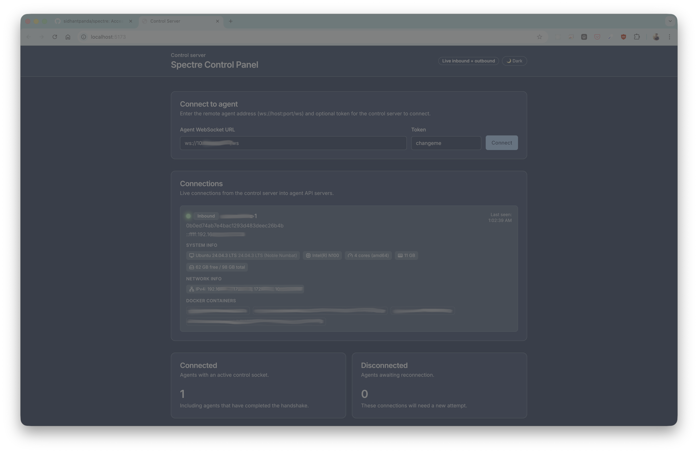

# Spectre

Reference layout for a two-part remote command streaming stack:
- **server/** — Node.js + TypeScript control plane built with Express and `ws` that dials out to remote agents.
- **web-ui/** — Vite + React + TypeScript UI for asking the control server to connect to agent endpoints and run commands.
- **agent/** — Go-based agent that exposes an API/WebSocket server so the control plane can reach in and stream a PTY.

Both components use WebSockets for interactive keystroke and output streaming. Agents authenticate using a shared token and provide a fingerprint derived from machine characteristics so the server can recognize reinstalls.



## Agent installation
Releases include cross-compiled agents wrapped in archives that preserve execute bits on Unix and zip for Windows:
- Linux: `spectre-agent-linux-amd64.tar.gz`, `spectre-agent-linux-arm64.tar.gz`
- macOS: `spectre-agent-darwin-amd64.tar.gz`, `spectre-agent-darwin-arm64.tar.gz`
- Windows: `spectre-agent-windows-amd64.zip`, `spectre-agent-windows-arm64.zip`

Example download (replace `<tag>` with a release like `agent-v1.2.3`):

```bash
curl -L -o spectre-agent.tar.gz "https://github.com/sidhantpanda/spectre/releases/download/<tag>/spectre-agent-linux-amd64.tar.gz"
tar -xzf spectre-agent.tar.gz
sudo mv spectre-agent-linux-amd64 /usr/local/bin/spectre-agent
echo 'export PATH="/usr/local/bin:$PATH"' >> ~/.profile
echo 'export PATH="/usr/local/bin:$PATH"' >> ~/.zshrc
source ~/.profile 2>/dev/null || true
source ~/.zshrc 2>/dev/null || true
```

One-liner installer (auto-detects OS/arch, fetches latest release, installs to `/usr/local/bin`):

```bash
curl -fsSL https://raw.githubusercontent.com/sidhantpanda/spectre/main/scripts/install-agent.sh | sudo bash
```

If you cannot use sudo, install to a writable dir and re-source your shell:

```bash
BIN_DIR="$HOME/.local/bin" curl -fsSL https://raw.githubusercontent.com/sidhantpanda/spectre/main/scripts/install-agent.sh | bash
echo 'export PATH="$HOME/.local/bin:$PATH"' >> ~/.profile
echo 'export PATH="$HOME/.local/bin:$PATH"' >> ~/.zshrc
source ~/.profile 2>/dev/null || true
source ~/.zshrc 2>/dev/null || true
```

Uninstall (removes service + binary; set `BIN_DIR` if you installed elsewhere):

```bash
curl -fsSL https://raw.githubusercontent.com/sidhantpanda/spectre/main/scripts/uninstall-agent.sh | sudo bash
```

### Running the agent as a service (Linux/macOS)
Install the binary in your `$PATH` (e.g., `/usr/local/bin`), then run:

```bash
sudo spectre-agent up -token <token> -host ws://<control-server-host>:8080/agents/register
```

This writes the service definition, enables it on boot, and starts it immediately. To stop and remove the service:

```bash
sudo spectre-agent down
```

Defaults: `-listen :8081`, `-token changeme`, optional `-host` for agent-initiated outbound control connections. Override these flags on `up` to bake them into the service definition.

Windows users should run the extracted `spectre-agent-windows-*.exe` in a normal console or set up a Windows service manually.

## Development
1. Start the control server API (see `server/README.md` for details):
   ```bash
   cd server
   npm install
   npm run dev
   ```
2. Start the UI for interacting with the control server:
   ```bash
   cd web-ui
   npm install
   npm run dev
   ```
3. Run the agent on a target machine. It hosts its own API/WebSocket server and waits for the control plane to connect:
   ```bash
   cd agent
   export AGENT_HOST=ws://localhost:8080/agents/register # control server address or inbound connections
   ./dev.sh
   ```
   Only one agent instance runs per machine; starting another prints the active PID and connection URL for reuse.
