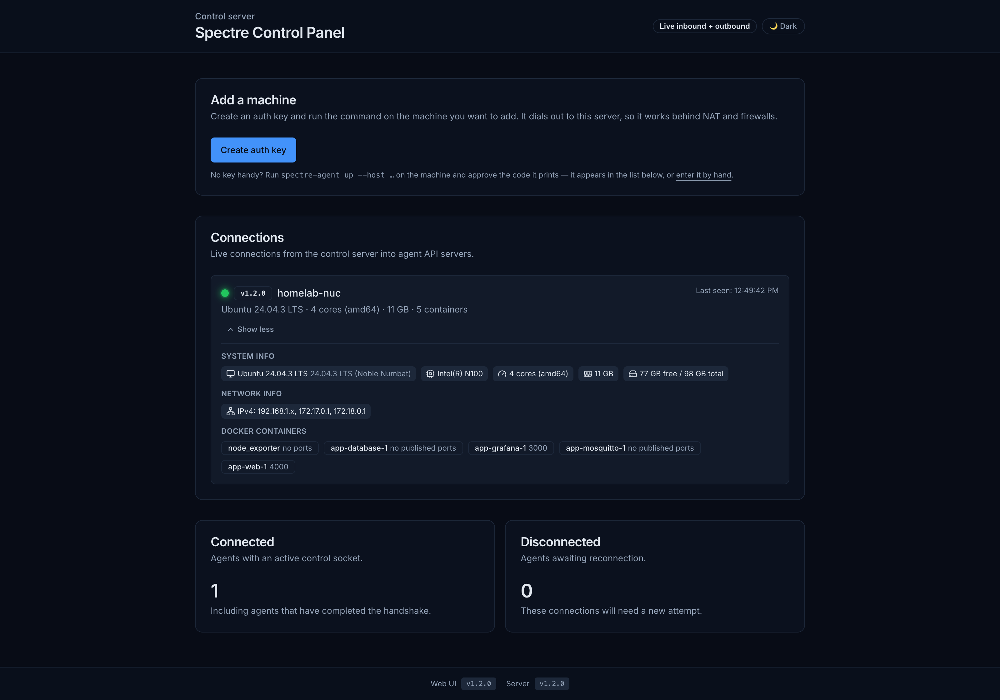

# Spectre

**A terminal on every machine you own, in any browser.**

Spectre gives you a shell on your servers, home lab boxes, and Raspberry Pis from a browser tab — your phone, a tablet, or someone else's laptop. No SSH keys to carry, no VPN, no port forwarding.



Install the agent on a machine, approve it once, and it shows up in the web UI. Click it, get a shell. With **tmux** installed, sessions survive disconnects — close the tab on your phone, reopen it on your laptop, and your half-finished command is still there.

```
Browser ◄──── WebSocket ────► Spectre server ◄──── WebSocket ────► Agent (+ tmux)
```

The agent **dials out** to your server and never opens a port, so it works behind NAT, CGNAT, and restrictive firewalls. There is nothing to expose on the machines you're connecting to.

---

## Quickstart

Two steps: run a server, add a machine.

### 1. Run the server

```bash
# Generate a password — the server will not start without one.
export ADMIN_PASSWORD=$(openssl rand -base64 24)
echo "Your password: $ADMIN_PASSWORD"

curl -fsSL https://raw.githubusercontent.com/sidhantpanda/spectre/main/compose.yaml -o compose.yaml
docker compose up -d
```

Open `http://<server-ip>:3000` and log in.

> **Before you expose this to the internet**, put it behind a reverse proxy with TLS and use `wss://`. Spectre hands out root shells; treat the server like an SSH bastion. See [Production checklist](docs/GUIDE.md#production-checklist).

### 2. Add a machine

Install the agent on the machine you want a shell on:

```bash
curl -fsSL https://raw.githubusercontent.com/sidhantpanda/spectre/main/scripts/install-agent.sh | sudo bash
```

Then connect it. Pick whichever fits:

**Interactive** — no secrets to copy around. Run this on the machine:

```bash
sudo spectre-agent up --host wss://spectre.example.com
```

It prints a code and a link. Open the link in Spectre, approve the code, done:

```
To add this machine, open Spectre and approve it:

    https://spectre.example.com/enroll

    Code:  XNV3-VH3T

Waiting for approval...
```

**Non-interactive** — for scripts, cloud-init, and images. Create an auth key in the UI ("Add a machine" → *Create auth key*), then:

```bash
sudo spectre-agent up --host wss://spectre.example.com --authkey sk_...
```

Either way the machine enrolls, stores a device key, installs itself as a service, and reconnects on boot. Click it in the UI to open a terminal.

---

## Security model

Spectre gives a browser a root shell on your machines. That deserves to be stated plainly.

| | |
|---|---|
| **Who can open a shell** | Anyone with the `ADMIN_PASSWORD`. There is one admin; there are no per-user accounts or per-machine ACLs yet. |
| **How machines authenticate** | Each machine holds its own **device key**, issued at enrollment and stored `0600`. Keys are stored **hashed** on the server — a stolen database cannot impersonate a machine. |
| **How machines are added** | An **auth key** (single-use by default, expiring) or an admin approving a code. A machine is never trusted until you say so. |
| **What the agent exposes** | Nothing. It dials out and listens on no port. |
| **Revoking a machine** | Revoke it in the UI — the live session is killed immediately and the key stops working. |
| **Transport** | Use `wss://`. Bare hostnames default to TLS; the agent warns loudly on plaintext to a non-local host. |

**The server refuses to start without `ADMIN_PASSWORD`.** This is deliberate: an unauthenticated Spectre server is an anonymous root shell for every enrolled machine. For local development only, set `SPECTRE_DEV_NO_AUTH=1` (which is itself refused when `NODE_ENV=production`).

Credentials never appear in URLs or logs. Agents authenticate with an `Authorization` header, and browser terminals use short-lived single-use tickets, because query strings end up in proxy logs and `Referer` headers.

Found a security issue? Please report it privately rather than opening a public issue.

---

## Develop

`server` (API) and `web-ui` are a **pnpm workspace**; `agent` is a Go module. You need **Node 22+**, **pnpm 11+**, and **Go 1.21+** for the agent.

```bash
pnpm install     # once
pnpm dev         # API on :8080 + web UI on :5173
```

Open **http://localhost:5173**. `pnpm dev` sets `SPECTRE_DEV_NO_AUTH=1`, so there's no login in development.

To run an agent against your dev server:

```bash
pnpm dev:agent   # mints an auth key, enrolls, and hot-reloads on changes
```

```bash
pnpm test        # test every package
pnpm build       # build every package
pnpm lint        # type-check the web UI
```

More detail — per-package commands, Docker Compose, the HTTP/WebSocket API, and the wire protocol — is in the [developer & operator guide](docs/GUIDE.md).

## Repo layout

| Path | What |
|------|------|
| `server/` | Node.js + TypeScript control server (`@spectre/server`) |
| `web-ui/` | React + Vite web UI (`@spectre/web-ui`) |
| `agent/` | Go agent that runs on remote machines |
| `docs/` | Developer & operator guide |

## Documentation

- [How it works](docs/GUIDE.md#how-it-works) — architecture and the connection model
- [Production checklist](docs/GUIDE.md#production-checklist) — TLS, reverse proxy, hardening
- [The agent](docs/GUIDE.md#the-agent) — install, enroll, daemon, uninstall
- [The server](docs/GUIDE.md#the-server) — configuration and API reference
- [Protocol reference](docs/GUIDE.md#protocol-reference) — the wire format

## License

See [LICENSE](LICENSE).
